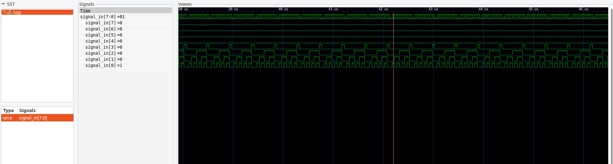

# PRU Embedded Logic Analyzer

An 8-bit embedded logic analyzer for the BeagleBone Black or Green, featuring automated VCD file generation for waveform viewing in tools like GTKWave.

This project is designed to be easy to set up and provides an alternative to a dedicated logic analyzer, or an embedded analyzer in the context of digital design (i.e., FPGA logic implementation). It leverages the real-time capabilities of the AM3358's PRU cores and enables high-speed digital signal traces with user-configured sizes.

## Getting Started

## 🔧 Getting Started

### 1. Clone the Repository

```bash
git clone git@github.com:Rajnesh28/PRU-logic-analyzer.git
cd pru-logic-analyzer
```

---

### 2. Wiring the Input Signals

PRU Core 1 maps its **least significant byte (LSB)** directly to GPIO pins, allowing single-cycle reads of the entire incoming 8-bit signal. The PRU has single-cycle access to GPIO. 

**Wire your 8-bit signal to the following BeagleBone GPIO pins:**

| Bit | PRU GPIO Pin |
| --- | ------------ |
| 0   | P8\_45       |
| 1   | P8\_46       |
| 2   | P8\_43       |
| 3   | P8\_44       |
| 4   | P8\_41       |
| 5   | P8\_42       |
| 6   | P8\_39       |
| 7   | P8\_40       |

> Reference: [glennklockwood.com](https://www.glennklockwood.com/embedded/beaglebone-pru.html)
> Reference: [Programmable Real-time Unit Subsystem Training Material](https://caxapa.ru/thumbs/319913/PRUSS_Training_Slides.pdf)

---

### 3. Configure Pins as Inputs

Before running the analyzer, configure each pin for PRU input:

```bash
config-pin P8_45 pruin
config-pin P8_46 pruin
config-pin P8_43 pruin
config-pin P8_44 pruin
config-pin P8_41 pruin
config-pin P8_42 pruin
config-pin P8_39 pruin
config-pin P8_40 pruin
```

---

### 4. Compile and Run

Compile the analyzer:

```bash
gcc main.c PRUHandler.c VCDGenerator.c -o main
```

Then run it with the desired number of bytes to trace:

```bash
./main 61280
```

> A Makefile is planned to simplify the build process.
> A known bug exists where the tracing ends prematurely for various input sizes.

---

5. Open the waveform using GTKWave, `GTKWave wave.vcd`

---

## Technical Details:

This logic analyzer uses a **ping-pong buffer scheme** in PRU Shared Memory to transfer data from PRU Core 1 to the ARM core efficiently.

**Memory Map (12 KB PRU Shared Memory):**

* **Bytes 0–31**: Reserved (flagg)
* **Bytes 32–6127**: Ping buffer
* **Bytes 6128–12287**: Pong buffer

The PRU writes to one half of the buffer and toggles a flag for the ARM core to read. The ARM core polls this flag and copies the data to DDR. This forms a **producer-consumer loop**.

> Memory write operations by the PRU are single-cycle (fire-and-forget), but arbitration may introduce slight variability. To minimize this, only **one PRU core** is used—ensuring the bus arbitrator always grants access predictably.

---

### Performance Notes

* The PRU operates at **200 MHz**, with instructions executing in **1 cycle** due to its zero-stage pipeline architecture.
* The main polling loop on the ARM side is carefully minimized for **predictable latency**.
* Based on the Nyquist-Shannon theorem, the theoretical maximum traceable signal frequency is **half the loop execution frequency**.

Fortunately, while the PRU code is written in C, we may use the disassembler to see the assembly instructions and try and estimate the maximum sampling frequency. ## To-do
`dispru pru_fw > dispru_fw` (need TI PRU CGT tools installed)
`vi dispru_fw`
* In my testing thus far, I've seen a pattern that was **50 MHz** traced with low aliasing. The period on the waveform is a bit arbitrary (hard-coded in `VCDGenerator.c`), I still need to clarify assumption and estimate what an actual more accurate sampling rate is for this.



### RPMsg Not Used

This implementation avoids the RPMsg framework to eliminate messaging overhead and achieve **ultra-low latency**, which is critical for accurate high-frequency tracing. The goal is to keep the while loop in the PRU code as minimal as possible.

---

## 📋 To-Do

* [ ] Investigate trace count mismatch on some inputs
* [ ] Optimize PRU for even shorter trace loop (switch to assembly)
* [ ] Add Makefile and clarify assumptions for user-friendliness
